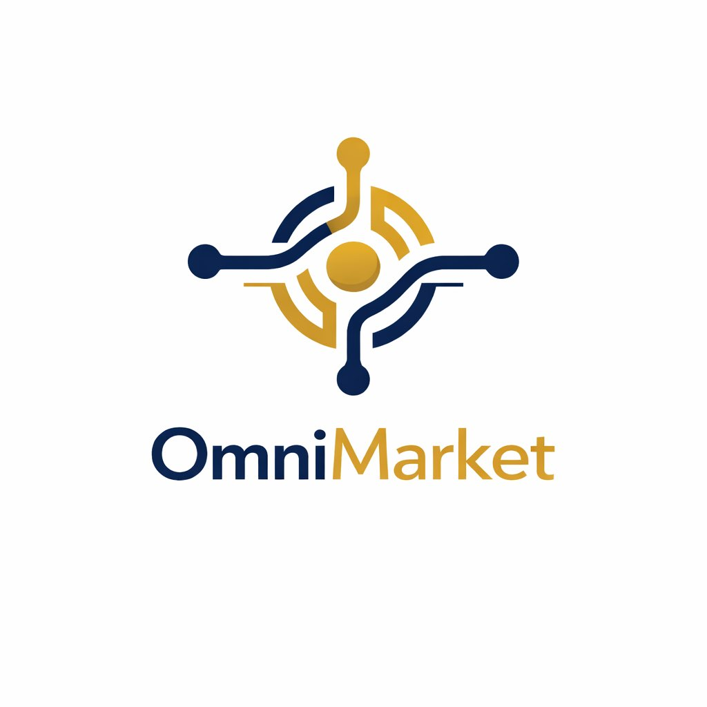

<p align="center">
  
</p>

# OmniMarket — Sistema de Gestão para Supermercados

Sistema completo de gestão para supermercados com PDV offline-first, painel administrativo web e app mobile.

## Estrutura do Monorepo

```
/
├── apps/
│   ├── backend/     → API REST + WebSocket (NestJS + TypeScript)
│   ├── pdv/         → PDV desktop offline-first (Electron + React + SQLite)
│   └── admin/       → Painel administrativo web (React + Vite + Tailwind)
├── packages/
│   └── shared/      → Types e interfaces compartilhados (TypeScript)
├── supabase/        → Schemas SQL, migrations e seed
└── docs/            → Documentação do projeto
```

## Requisitos

| Ferramenta | Versão mínima |
| ---------- | ------------- |
| Node.js    | 20.x          |
| Yarn       | 1.22.x        |

## Primeiros Passos

### 1. Instalar dependências

```bash
yarn install
```

### 2. Configurar variáveis de ambiente

```bash
cp apps/backend/.env.example apps/backend/.env
# Edite apps/backend/.env com suas credenciais
```

### 3. Rodar em desenvolvimento

```bash
# Backend (porta 3000)
yarn dev:backend

# Admin (porta 5173)
yarn dev:admin

# PDV (Electron + Vite, porta 5174)
yarn dev:pdv
```

## Scripts disponíveis na raiz

| Comando            | Descrição                              |
| ------------------ | -------------------------------------- |
| `yarn dev:backend` | Inicia o backend em modo watch         |
| `yarn dev:admin`   | Inicia o admin em modo dev             |
| `yarn dev:pdv`     | Inicia o PDV (Electron + Vite)         |
| `yarn build:*`     | Build de produção de cada app          |
| `yarn lint`        | Lint em todos os workspaces            |
| `yarn format`      | Formata todos os arquivos com Prettier |

## Stack Tecnológica

- **Backend:** NestJS · PostgreSQL via Supabase · WebSocket
- **Admin:** React 18 · Vite · Tailwind CSS · Zustand · React Hook Form
- **PDV:** Electron · React · SQLite (better-sqlite3) · Sync offline-first
- **Fiscal:** Focus NFe (NFC-e) · Certificado A1
- **Pagamentos:** Pagar.me (cartão/PIX)
- **Tributário:** IBPT (alíquotas por NCM)

## Perfis de Acesso

| Perfil     | Permissões                                     |
| ---------- | ---------------------------------------------- |
| `ADMIN`    | Acesso total                                   |
| `GERENTE`  | Gestão operacional, sem configurações críticas |
| `OPERADOR` | Somente PDV e consultas                        |

## Convenções

- Commits em português no formato Conventional Commits: `feat(módulo): descrição`
- TypeScript strict em todo o projeto
- Variáveis e funções em inglês; comentários podem ser em português

## Fases do Projeto

1. **Fundacao** — Monorepo, configs, design system
2. **Auth** — JWT, perfis, ACL
3. **Produtos** — CRUD, IBPT, importacao CSV
4. **PDV** — Vendas, offline, hardware
5. **Fiscal** — NFC-e, certificado A1
6. **Estoque/Relatorios** — Movimentacoes, curva ABC, dashboard
7. **Testes/Deploy** — Jest, Railway, Sentry, build .exe
